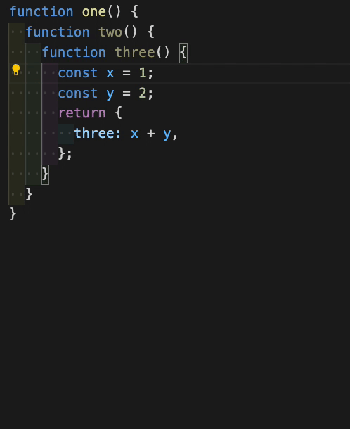
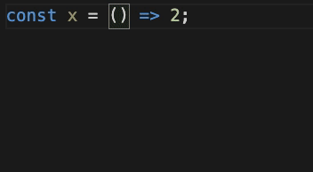

# Lazy Debugger

Sometimes launching a debugger is a hassle.

**Why not go the good old quick and dirty route instead?**

## Features

- Easily add and remove console.log statements after each line for easy debugging
- Supports all types of functions (if not, let me know)

## Extension Settings

This extension contributes the following settings:

- `lazydebugger.toggle`: adds or removes the console.log statements
